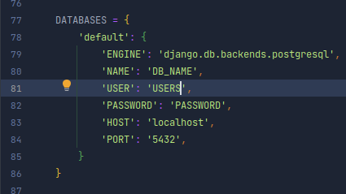
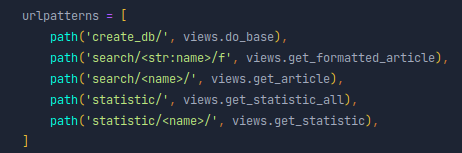

## Тестовое задание
### Построен на базе фреймворка Python Django 

 Сначала требуется установить все зависимости из "requirements.txt"  
команда:
 > **_pip install -r requirements.txt_**  

Затем разархивировать файл в папке static/  
Название файла ruwikiquote-20230213-cirrussearch-general.json.gz  
После разархивации ruwikiquote-20230213-cirrussearch-general.json
___

## Запуск

### 1. Создание БД 
> База данных — PostgreSQL  

Нужно создать базу данных и изменить в файле settings.py поля "NAME", "USER", "PASSWORD"   
на ваши значения  

### 2. Применение миграций
Тем самым создав таблицы в базе данных
> python3 manage.py migrate
### 3. Запуск
> python3 manage.py runserver
> 
#### Пять рабочих путей   
* wiki/create_db - как только проект запущен, нужно зайти именно на эту страницу,  
чтобы файл с дампом начал парситься. Как только страница прогрузится и вернёт надпись   
Well Done!, значит файл с дампом полностью в бд. (Также можно не ждать конца:   
элементы, по мере парсинга, добавляются в бд, можно остановить проект в любой момент,  
перезапустить его и работать с данными). ((Я сделал его как ссылку, чтобы можно было передавать названия файлов
для парсинга в бд))
  
* wiki/search/Назавние_статьи - выводит строку Json в браузере
* wiki/search/Назавние_статьи/f - выводит Json отформатированный по полям
* wiki/statistic - выводит статистику по всем категориям
* wiki/statistic/Название_категории - выводит статисткику по назанию категории

> Работу выполнил - Осташов Алексей
